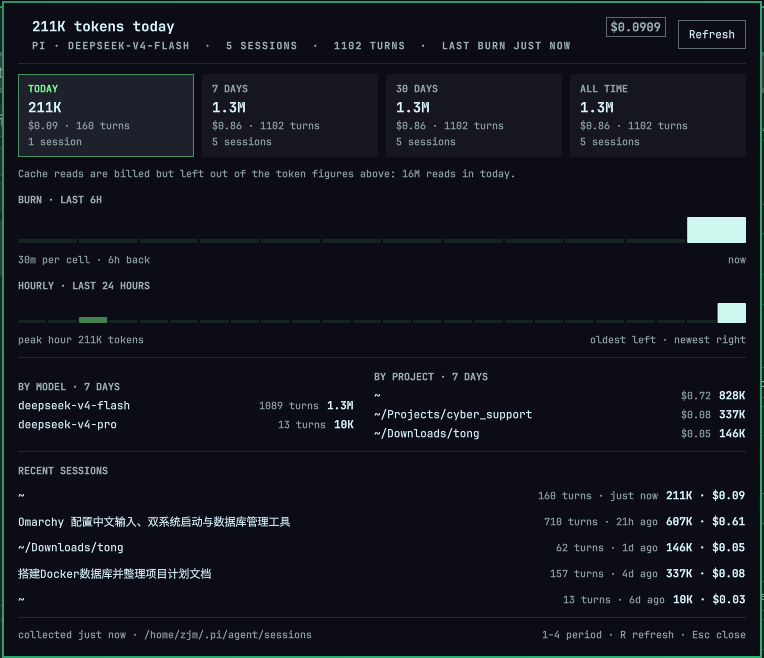

# Pi Usage

A bar widget for [Omarchy](https://omarchy.org/) that answers one question:
**what has pi burned today, and what did it cost?**

It reads pi's own session transcripts (`~/.pi/agent/sessions/**/*.jsonl`), so it
works for DeepSeek and for any other provider pi is pointed at, and it shows:

- a heat strip in the bar of the recent window (default: the last 6 hours),
- one period's tokens and dollars beside it (default: today),
- a click-through report: four periods, the burn window, the last 24 hours by
  the hour, tokens by model, by project, and the most recent sessions.



## Install

Pick one route.

**From the repository** (git access to github.com required — SSH is the one that
works on networks that block github.com's HTTPS):

```sh
omarchy plugin add https://github.com/zhongtie/pi-usage.git --enable --yes
omarchy plugin update zjm.pi-usage        # later, to pull a new version
```
or
```sh
omarchy plugin add git@github.com:zhongtie/pi-usage.git --enable --yes
omarchy plugin update zjm.pi-usage        # later, to pull a new version
```

On a machine that has more than one GitHub account in `~/.ssh/config`, name the
alias instead of `github.com` so the right key is used:

```sh
omarchy plugin add git@github-zhongtie:zhongtie/pi-usage.git --enable --yes
```

**As a plain copy** (no git, no network — a USB stick or `rsync` will do):

```sh
# on a machine that has it
tar -czf pi-usage.tar.gz -C ~/.config/omarchy/plugins zjm.pi-usage

# on the new machine
mkdir -p ~/.config/omarchy/plugins
tar -xzf pi-usage.tar.gz -C ~/.config/omarchy/plugins
omarchy-shell shell rescanPlugins
omarchy plugin enable zjm.pi-usage --section center
```

Nothing else needs migrating: the widget reads the *target* machine's own
`~/.pi/agent/sessions` and rebuilds its state under
`~/.local/state/omarchy/pi-usage/`. If the new machine's username is not
`zjm`, rename the id first so it keeps the `<user>.<name>` convention:

```sh
cd ~/.config/omarchy/plugins
mv zjm.pi-usage $USER.pi-usage && cd $USER.pi-usage
sed -i "s/zjm\.pi-usage/$USER.pi-usage/g" manifest.json BarWidget.qml PiUsagePanel.qml README.md
```

Move it anywhere on the bar with:

```sh
omarchy bar move zjm.pi-usage --section right
```

Remove it with `omarchy plugin remove zjm.pi-usage`.

**After editing any QML in here, restart the shell** — the plugin reloader
re-registers the plugin but Qt keeps the compiled component cached for the
same file URL, so an edit only takes hold on a fresh shell:

```sh
omarchy restart shell
```

## Using it

| Input | Does |
|---|---|
| Left click | Opens the report |
| Right click | Cycles the label period: today → 7 days → 30 days → all time |
| Middle click | Forces a fresh collect |
| `1` `2` `3` `4` | In the report: pick the period |
| `R` / `Esc` | In the report: refresh / close |

The period is stored in `shell.json`, so a cycle survives a restart.

```sh
omarchy-shell zjm.pi-usage status     # open/closed, period, current total
omarchy-shell zjm.pi-usage refresh    # force a collect
omarchy-shell zjm.pi-usage toggle     # open/close the report
```

## Settings

Set these on the widget's own entry:

```sh
omarchy bar set zjm.pi-usage windowMinutes 720
omarchy bar set zjm.pi-usage cells 24
omarchy bar set zjm.pi-usage showCost false
```

| Key | Default | Meaning |
|---|---|---|
| `windowMinutes` | `360` | How far back the heat strip reaches (30–1440) |
| `cells` | `12` | Cells drawn in the strip (4–48) |
| `refreshIntervalSec` | `10` | How often the collector runs (5–600) |
| `labelPeriod` | `today` | `today`, `d7`, `d30`, `all` |
| `showCells` | `true` | Draw the strip |
| `showCost` | `true` | Show dollars beside tokens |
| `followTheme` | `true` | Theme accent; off pins DeepSeek blue |

## How it works

```
bin/pi-usage-collect          python3, no third-party imports
  ~/.pi/agent/sessions/**/*.jsonl
    -> every assistant message's message.usage
    -> $XDG_STATE_HOME/omarchy/pi-usage/report.json
  unchanged files (same mtime and size) come out of scan-cache.json
BarWidget.qml                 runs the collector, watches report.json,
                              draws the strip, owns the popup
PiUsagePanel.qml              the report
```

`tokens` is billable burn: fresh input + cache writes + output. Cache reads are
billed too but at a fraction of the rate and an order of magnitude more tokens,
so they are reported separately instead of swamping the heat scale. Cost is
pi's own `usage.cost.total`, summed.

The collector never parses anything but the transcripts, never reads message
text (only token counts, model ids, timestamps, cost and the session's cwd),
and never talks to a provider.
